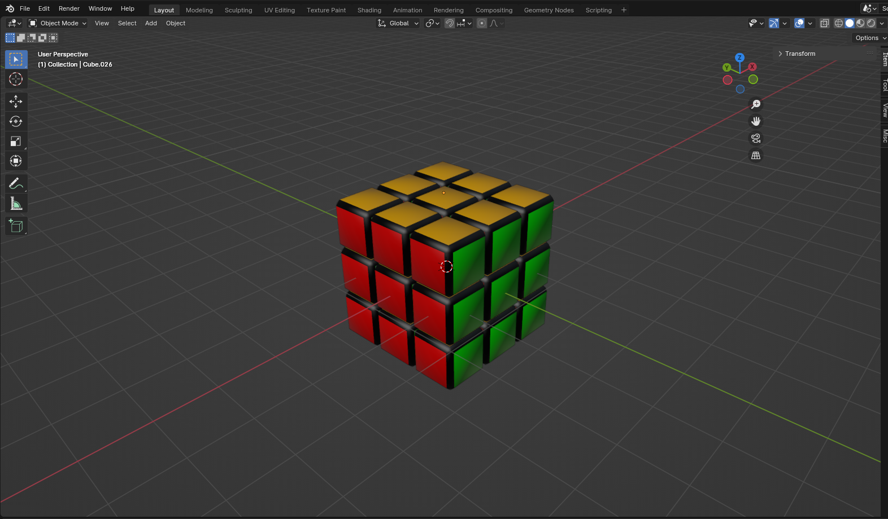
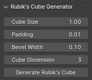

# Générateur de Rubik's Cube dans Blender

Ce projet propose un script Python pour Blender permettant de générer un Rubik's Cube personnalisable directement dans la vue 3D. Le script offre la possibilité de définir plusieurs paramètres, tels que la taille des cubes, l'espacement entre eux, la largeur du biseau et la dimension du cube (par exemple 3x3, 4x4, etc.).

## Fonctionnalités

- **Génération dynamique de cubes** : Créez un Rubik's Cube de n'importe quelle dimension (de 2x2 à 10x10) avec une taille et un espacement personnalisables.
- **Attribution automatique des matériaux** : Chaque face du cube se voit automatiquement assigner une couleur distincte, comme un vrai Rubik's Cube.
- **Modifier de biseau** : Applique des arêtes lisses aux cubes en utilisant le modificateur de biseau de Blender, avec une largeur de biseau ajustable.
- **Lissage des formes** : Les faces des cubes sont automatiquement lissées pour un rendu plus soigné.

## Paramètres personnalisables

- **Taille des cubes** : Ajustez la taille des cubes individuels.
- **Espacement** : Définissez l'espace entre les cubes.
- **Largeur du biseau** : Contrôlez la largeur du biseau appliqué aux arêtes des cubes.
- **Dimension du Rubik's Cube** : Configurez la dimension du Rubik's Cube (par exemple, 3x3, 4x4, etc.).

